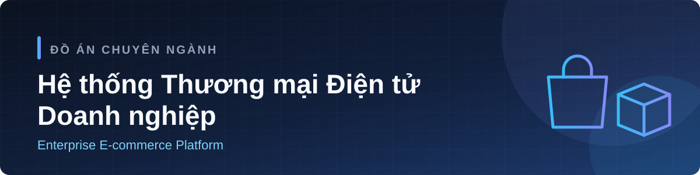

  

  
  
  

  <a href="#-đề-tài">Đề tài</a> ·
  <a href="#-công-nghệ">Công nghệ</a> ·
  <a href="#-tài-liệu-tham-khảo">Tài liệu tham khảo</a> ·
  <a href="#-thành-viên">Thành viên</a> ·
  <a href="#-repository">Repository</a> ·
  <a href="#-tiến-độ">Tiến độ</a>

## 📖 Đề tài

**Phát triển Hệ thống Thương mại Điện tử Doanh nghiệp** · *Enterprise E-commerce Platform*

### 📌 Mô tả

Đề tài "Phát triển Hệ thống Thương mại Điện tử Doanh nghiệp" hướng tới việc xây dựng một giải pháp phần mềm toàn diện, đáp ứng nhu cầu chuyển đổi số và tối ưu hóa vận hành cho các doanh nghiệp bán lẻ hiện đại. Trong bối cảnh thị trường trực tuyến đòi hỏi sự thích ứng liên tục, một nền tảng có kiến trúc module linh hoạt, hiệu năng cao và khả năng mở rộng tốt là yếu tố then chốt để doanh nghiệp bứt phá và duy trì lợi thế cạnh tranh.

Mục tiêu cốt lõi của dự án là phát triển một ứng dụng web fullstack hoàn chỉnh, bao quát toàn bộ chuỗi cung ứng và quy trình bán hàng. Hệ thống cung cấp các phân hệ quản trị chuyên sâu bao gồm: quản lý danh mục và biến thể sản phẩm, kiểm soát kho vận chặt chẽ (phiếu nhập/xuất, cảnh báo ngưỡng tồn kho), giỏ hàng, và hệ thống duyệt đơn (Fulfillment) tự động hóa dựa trên State Machine. Đồng thời, dự án giải quyết triệt để bài toán tài chính thông qua module quản lý hóa đơn, chứng từ thu chi và tích hợp trực tiếp các cổng thanh toán phổ biến như VNPay, MoMo, ZaloPay và VietQR.

Về mặt công nghệ, dự án ứng dụng các bộ công cụ tiên tiến mang tiêu chuẩn công nghiệp. Frontend được tối ưu hóa với Next.js 16, React 19 và TailwindCSS, đảm bảo tốc độ tải trang và trải nghiệm mượt mà. Backend được thiết kế bằng Node.js/Express và TypeScript theo kiến trúc 4 lớp chuẩn Enterprise, kết hợp cơ sở dữ liệu MongoDB và bộ đệm Redis. Hệ thống thiết lập cơ chế bảo mật nghiêm ngặt với xác thực OAuth2/JWT và phân quyền chi tiết theo vai trò (Role-Based Access Control) cho Admin, Sale và Khách hàng.

Điểm nổi bật của đề tài là việc tích hợp các công nghệ nâng cao như Trợ lý AI hỗ trợ tư vấn tức thời và hệ thống thông báo thời gian thực (Websocket/SSE). Hơn nữa, dự án đảm bảo tính ổn định cao thông qua quy trình kiểm thử tự động (Unit Test, E2E) và được đóng gói, triển khai hạ tầng mạnh mẽ qua Docker, Kubernetes. Các công cụ giám sát vận hành (Prometheus, Grafana) cũng được áp dụng để theo dõi "sức khỏe" hệ thống.

Nhìn chung, đề tài cung cấp một hệ sinh thái thương mại điện tử trọn vẹn, không chỉ nâng tầm trải nghiệm mua sắm của người dùng cuối mà còn là công cụ quản trị đắc lực, sẵn sàng chịu tải và vận hành trong môi trường doanh nghiệp thực tế.

### 🎯 Yêu cầu

Để hiện thực hóa mục tiêu phát triển Hệ thống Thương mại Điện tử Doanh nghiệp một cách toàn diện, quá trình thực hiện dự án được chia thành các nhóm nhiệm vụ cụ thể và liên kết chặt chẽ với nhau. Bước đầu tiên mang tính chất nền tảng là tiến hành khảo sát và phân tích chuyên sâu các quy trình nghiệp vụ kinh doanh. Từ đó, tiến hành xây dựng tài liệu Đặc tả yêu cầu phần mềm (SRS) hoàn chỉnh, bao gồm việc thiết kế chi tiết các biểu đồ Use Case, luồng dữ liệu (DFD), sơ đồ thực thể kết hợp (ERD), cũng như tài liệu REST API Spec theo chuẩn mực OpenAPI/Swagger. Song song với đó, hệ thống UI Design System được thiết kế nhằm đảm bảo tính đồng nhất và tối ưu hóa trải nghiệm người dùng trên toàn hệ thống.

Khi bản thiết kế hoàn thiện, nhiệm vụ tiếp theo là thiết lập kiến trúc nền tảng (Base Architecture) với các tiêu chuẩn công nghiệp. Ở phía Backend, hệ thống được thiết kế theo mô hình 4 lớp chuẩn Enterprise, cấu hình quản lý lỗi tập trung và kiểm chứng dữ liệu bằng Zod. Phía Frontend được thiết lập vững chắc bằng Next.js 16, React 19 cùng TailwindCSS v4. Toàn bộ quy trình phát triển được chuẩn hóa thông qua mô hình Git Flow và sử dụng Docker Compose để đồng bộ hóa các dịch vụ cơ sở dữ liệu cốt lõi như MongoDB và Redis.

Trọng tâm của đề tài nằm ở nhiệm vụ lập trình và phát triển các phân hệ nghiệp vụ. Trước hết là thiết lập cơ chế xác thực bảo mật OAuth2/JWT và phân quyền chi tiết theo vai trò (RBAC) cho người quản trị, nhân viên bán hàng và khách hàng. Kế đến, dự án tiến hành xây dựng các module quản trị danh mục sản phẩm, biến thể, lưu trữ hình ảnh, và thiết lập luồng quản lý kho bãi với tính năng cảnh báo tồn kho tự động. Đặc biệt, nghiệp vụ xử lý đơn hàng đòi hỏi việc xây dựng một State Machine phức tạp để quản lý chặt chẽ vòng đời của quy trình duyệt đơn và giao hàng. Đồng thời, nhiệm vụ tích hợp phân hệ tài chính được thực hiện nhằm kiểm soát hóa đơn, chứng từ thu chi, kết hợp cùng các cổng thanh toán trực tuyến phổ biến như VNPay, MoMo, ZaloPay và VietQR để tự động hóa luồng dòng tiền.

Để nâng cao giá trị thực tiễn, dự án còn thực hiện nhiệm vụ nghiên cứu và tích hợp các công nghệ nâng cao như hệ thống thông báo thời gian thực (Websocket/SSE) và ứng dụng Trợ lý AI để tối ưu dịch vụ tư vấn khách hàng. Cuối cùng, hệ thống sẽ trải qua quá trình kiểm thử tự động nghiêm ngặt (Unit Test, E2E Test), tối ưu hóa bộ đệm và hiệu năng. Sản phẩm hoàn thiện được đóng gói bằng Docker, triển khai lên hạ tầng Kubernetes và tích hợp hệ thống giám sát vận hành Prometheus, Grafana, khép lại bằng việc nghiệm thu và hoàn thiện quyển báo cáo tổng kết chỉn chu nhất.

## 🧰 Công nghệ

<table>
<tr><td><b>Frontend</b></td><td>  </td></tr>
<tr><td><b>Backend</b></td><td>   </td></tr>
<tr><td><b>Dữ liệu</b></td><td> </td></tr>
<tr><td><b>Bảo mật</b></td><td> </td></tr>
<tr><td><b>Kiểm thử</b></td><td></td></tr>
<tr><td><b>Vận hành</b></td><td>   </td></tr>
</table>

## 📚 Tài liệu tham khảo

1. Vercel. (2026). [Next.js Documentation](https://nextjs.org/docs). Vercel Inc.
2. Meta. (2026). [React Documentation](https://react.dev/). Meta Platforms, Inc.
3. Microsoft. (2026). [The TypeScript Handbook](https://www.typescriptlang.org/docs/handbook/intro.html). Microsoft Corporation.
4. Fowler, M. (2002). [Patterns of Enterprise Application Architecture](https://martinfowler.com/books/eaa.html). Addison-Wesley Professional.
5. Shannon, C., & Chodorow, K. (2023). MongoDB: The Definitive Guide, 4th Edition. O'Reilly Media.
6. Burns, B., Beda, J., Hightower, K., & Evenson, L. (2022). [Kubernetes: Up and Running, 3rd Edition](https://www.oreilly.com/library/view/kubernetes-up-and/9781098110192/). O'Reilly Media.
7. Laudon, K. C., & Traver, C. G. (2024). [E-Commerce 2024: Business, Technology and Society, 18th Edition](https://www.pearson.com/en-gb/subject-catalog/p/e-commerce-20232024-business-technology-society-global-edition/P200000010016). Pearson.
8. Parecki, A. (2018). [OAuth 2.0 Simplified](https://oauth2simplified.com/). Lulu.com.
9. Richardson, C. (2018). [Microservices Patterns: With examples in Java](https://www.manning.com/books/microservices-patterns). Manning Publications.
10. Volz, J. (2023). [Prometheus: Up & Running, 2nd Edition](https://www.oreilly.com/library/view/prometheus-up/9781098131135/). O'Reilly Media.
11. Banks, A., & Porcello, E. (2020). [Learning React: Modern Patterns for Developing React Apps](https://www.oreilly.com/library/view/learning-react-2nd/9781492051718/). O'Reilly Media.
12. Holmes, S., & Harrop, C. (2019). [Getting MEAN with Mongo, Express, Angular, and Node, 2nd Edition](https://www.manning.com/books/getting-mean-with-mongo-express-angular-and-node-second-edition). Manning Publications.
13. Turnbull, J. (2022). [The Docker Book: Containerization is the new virtualization](https://dockerbook.com/). James Turnbull.
14. Freeman, A. (2023). Pro Next.js with React, TypeScript, and Tailwind CSS. Apress.
15. Evans, E. (2003). [Domain-Driven Design: Tackling Complexity in the Heart of Software](https://www.informit.com/store/domain-driven-design-tackling-complexity-in-the-heart-9780321125217). Addison-Wesley Professional.
16. Martin, R. C. (2008). [Clean Code: A Handbook of Agile Software Craftsmanship](https://www.informit.com/store/clean-code-a-handbook-of-agile-software-craftsmanship-9780132350884). Prentice Hall.
17. Newman, S. (2019). [Building Microservices: Designing Fine-Grained Systems, 2nd Edition](https://www.oreilly.com/library/view/building-microservices-2nd/9781492034018/). O'Reilly Media.
18. Mozilla Developer Network (MDN). (2026). [HTTP Status Codes](https://developer.mozilla.org/en-US/docs/Web/HTTP/Reference/Status) and [Web Security Protocols](https://developer.mozilla.org/en-US/docs/Web/Security). Mozilla Foundation.
19. Redis Ltd. (2026). [Redis Documentation and Caching Strategies](https://redis.io/docs/latest/). Redis.
20. Cypress.io. (2026). [Cypress End-to-End Testing Documentation](https://docs.cypress.io/). Cypress.io.

## 👥 Thành viên

<table>
<tr>
<td align="center" width="160"><a href="https://github.com/ThanhNguyenNCT"> <b>@ThanhNguyenNCT</b></a></td>
<td align="center" width="160"><a href="https://github.com/davidnguyen1802"> <b>@davidnguyen1802</b></a></td>
<td align="center" width="160"><a href="https://github.com/khoaphunsonac"> <b>@khoaphunsonac</b></a></td>
</tr>
</table>

## 🗂️ Repository

| Repo | Nội dung |
|---|---|
| 📄 [**Documents**](https://github.com/DA-EC-System/Documents) | Tài liệu phân tích, thiết kế |
| 📝 [**Report**](https://github.com/DA-EC-System/Report) | Báo cáo đồ án (LaTeX) |

## 🚦 Tiến độ

| Giai đoạn | Trạng thái |
|---|---|
| Khảo sát, phân tích nghiệp vụ, SRS, UI Design System | 🔵 Đang làm |
| Kiến trúc nền (Base Architecture) | ⚪ Chưa bắt đầu |
| Phân hệ nghiệp vụ | ⚪ Chưa bắt đầu |
| Thông báo thời gian thực, Trợ lý AI | ⚪ Chưa bắt đầu |
| Kiểm thử, Docker, Kubernetes, giám sát | ⚪ Chưa bắt đầu |
| Nghiệm thu, báo cáo tổng kết | ⚪ Chưa bắt đầu |

Nhận đề tài 19/09/2026 · Cập nhật 28/09/2026
